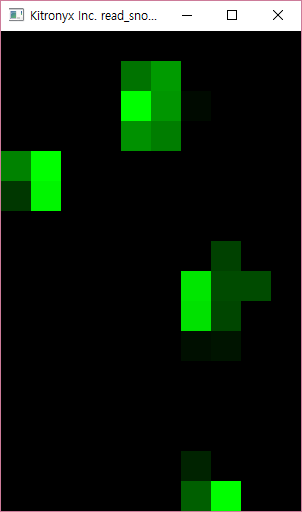

# klib-cpp
Kitronyx API for C/C++

DEVELOPMENT ENVIRONMENT
-----------------------
* Visual Studio 2015
* OpenFrameworks 0.9.2: OpenFrameworks folder should be at `c:\of_v0.9.2_vs_release\`
  * Download: http://www.openframeworks.org

QUICK START
-----------
* Download source code
* Open examples\examples.sln
